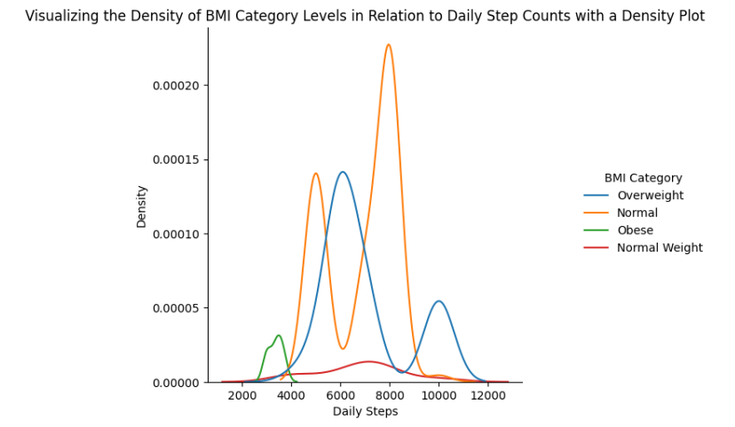
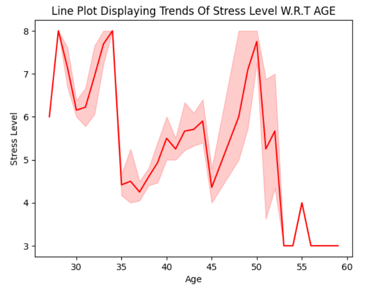

# SnoozeStats: Mapping Landscapes of Sleep & Lifestyle Variations 🌜💤📊

## Project Overview

Welcome to **SnoozeStats**, where we delve into the intricate relationships between sleep health, lifestyle factors, and their impact on overall well-being. The dataset for this analysis is the [Sleep Health and Lifestyle dataset](https://www.kaggle.com/datasets/uom190346a/sleep-health-and-lifestyle-dataset) sourced from Kaggle. The analysis was conducted using Python in Google Colab, leveraging powerful libraries such as Pandas, Matplotlib, and Seaborn.

## Data Processing 🛠️

The initial step involved meticulous cleaning and integration of the dataset, setting the stage for a comprehensive analysis. Data visualizations were crafted to uncover insights and provide a holistic understanding of the intricate connections within the dataset.

## Data Visualizations 📈📊

### Correlation Matrix

  

In summary, the dataset reveals strong positive correlations (0.88, 0.77, and 0.67) indicating robust relationships:

1. **Sleep Duration and Quality:** As sleep duration increases, sleep quality tends to improve (0.88).

2. **Daily Steps and Physical Activity Level:** More daily steps correspond to higher physical activity levels (0.77).

3. **Stress Level and Heart Rate:** Higher stress levels moderately associate with elevated heart rates (0.67).

These insights suggest potential connections between sleep, physical activity, stress, and cardiovascular health in the dataset.

### Density Plot

The density plot reveals a correlation between daily step counts and BMI categories. Individuals with daily steps ranging from 6000 to 9000 are more likely to have a "Normal" BMI, aligning with health recommendations for maintaining a healthy weight. Steps between 4000 to 6000 are associated with an "Overweight" BMI, suggesting a potential risk of being classified as overweight for individuals within this range. Daily steps below 4000 are linked to an "Obese" BMI, emphasizing the importance of regular physical activity in preventing obesity. These findings have practical implications for public health, advocating for higher daily step counts to promote weight management and reduce the risk of obesity.

### Line Plot

The line Plot reveals a noteworthy pattern in stress level concerning age. Between the age of 35 and 45, there is a decreasing trend with stress levels declining from 8 to 4. Following his between ages 45 and 55, stress levels again increases upto 8. This suggest that individuals experience a decrease in stress during their mid-thirties to mid-forties followed by a period of increasingly stress levels in their subsequent decade.

### Scatter Plot

A noticeable trend emerges among individuals above the age of 50. These individuals tend to exhibit lower stress levels and enjoy a good amount of sleep duration. This could be indicative
of a more relaxed lifestyle or reduced work-related stress in the later stages of life.
In the age range of 25 to 45, a cluster of points with heart rates between 68 and 75 stands out. Within this cluster, there is a pattern of higher stress levels and medium sleep duration. This suggests that individuals in this age range, with a specific heart rate range, tend to experience elevated stress levels despite achieving only moderate sleep durations

## Key Conclusions 🧠🔍

The analysis revealed pivotal insights into sleep health and lifestyle variations:

1. **Occupational Impact:** Professions like Nursing, Teaching, and Sales emerged as potential risk factors for sleep disorders, necessitating targeted interventions in these sectors.

2. **Age-related Patterns:** Individuals above 50 exhibited lower stress levels and healthier sleep habits, emphasizing age-specific considerations for stress management interventions.

3. **Gender-specific Variations:** Distinct sleep duration patterns were observed in females above the age of 45, highlighting the importance of gender-specific health considerations.

4. **Cardiovascular Health:** The correlation between age, stress, sleep, and heart rate underscored the need for age-specific stress management interventions, with a focus on gender-specific considerations in cardiovascular health.

## Trends & Insights 📈💡

The analysis uncovered significant trends and insights:

1. **Sleep Duration and Quality:** A robust positive correlation (0.88) highlighted the interconnected nature of sleep duration and quality, suggesting that improving sleep duration may enhance sleep quality.

2. **Stress and Heart Rates:** A moderate correlation (0.67) emphasized the link between stress and cardiovascular health, indicating the need for comprehensive stress management strategies.

3. **Physical Activity and BMI:** Density plots mapping daily steps to BMI categories provided actionable intelligence for targeted weight management processes, with outliers and cluster overlaps suggesting unique health patterns.

4. **Cardiovascular Fitness Insights:** Trends in physical activity levels (55 - 85) with heart rates around 70 offered practical insights for promoting cardiovascular fitness within this specific range.

## Suggestions/Recommendations 🌐🚀

### Sleep Enhancement Strategies:
- Prioritize sufficient sleep duration (7-8 hours per night).
- Educate on sleep hygiene practices, such as maintaining a consistent sleep schedule.

### Cardiovascular Fitness Promotion:
- Encourage regular physical activity (brisk walking, jogging, cycling) within observed heart rate and physical activity ranges.
- Develop fitness programs aligned with individual fitness levels.

### Stress Management:
- Implement comprehensive stress management programs addressing both psychological and physiological aspects.
- Incorporate stress-reduction techniques (mindfulness, meditation, relaxation exercises).

### Corporate Wellness Programs:
- Implement workplace wellness initiatives promoting healthy sleep habits, stress reduction, and opportunities for physical activity during breaks.

## Data Visualizations Used 📊📸

- **Box and Whisker Plot:** Illustrates distribution, central tendency, and variability of sleep duration and physical activity levels across different age groups.
- **Line Plot:** Visualizes the relationship between stress level and age.
- **Correlation Matrix Heatmap:** Comprehensive visualization of relationships and strengths of correlations between different variables in the dataset.
- **Density Line Plot:** Highlights density and distribution of daily steps across different BMI categories.
- **2D Distance Plot:** Identifies outliers and assesses the distance between heart rates and physical activity levels, providing a nuanced understanding of unique health patterns, particularly between genders.
- **Histogram:** Shows frequency distribution of sleep disorders among individuals with different occupations.
- **Pie Chart:** Concise representation of the distribution of sleep disorders within the entire dataset.
- **Scatterplot:** Multidimensional view incorporating multiple visual encodings for exploring relationships between stress level, sleep duration, age, and heart rate.
- **Contour Plot:** Showcases contours of sleep duration across different age groups, filtered by gender.
- **Violin Plot:** Offers insights into the distribution and density of physical activity levels among males and females, highlighting potential gender-specific patterns.

These insights and recommendations aim to empower individuals and organizations to make informed decisions for enhancing overall well-being based on a nuanced understanding of sleep, stress, physical activity, and cardiovascular health.
